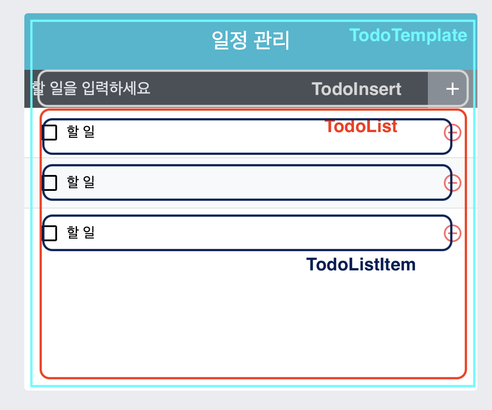
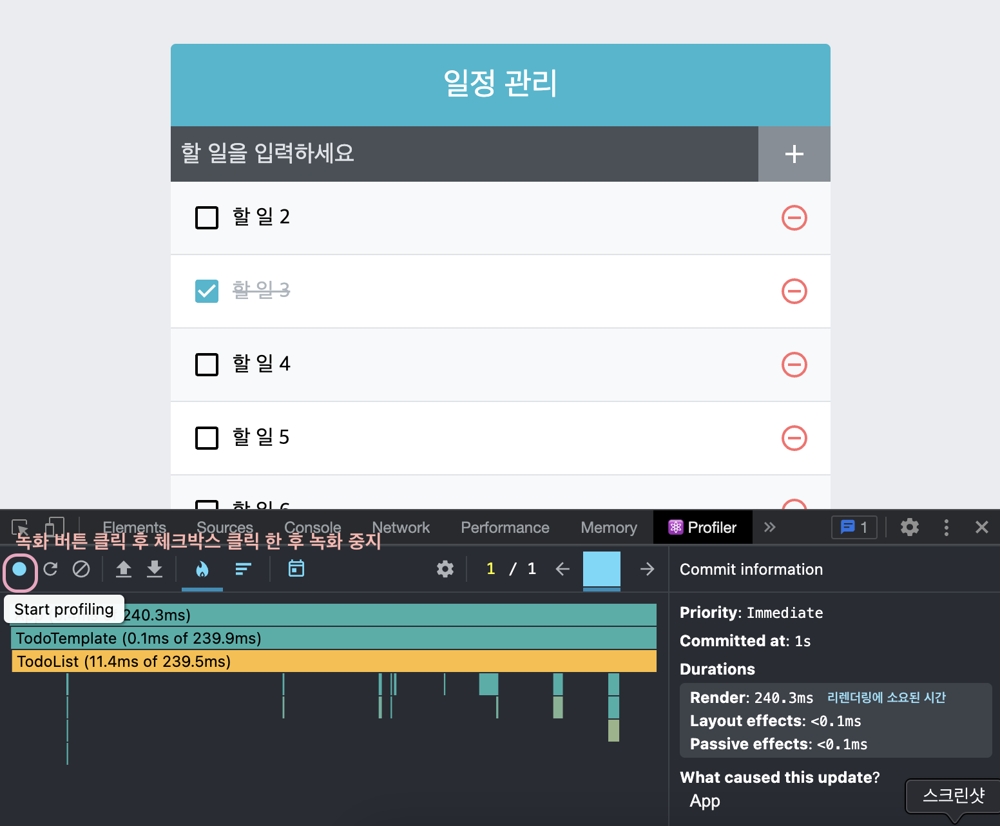
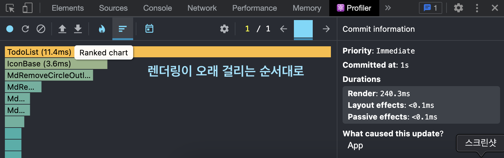
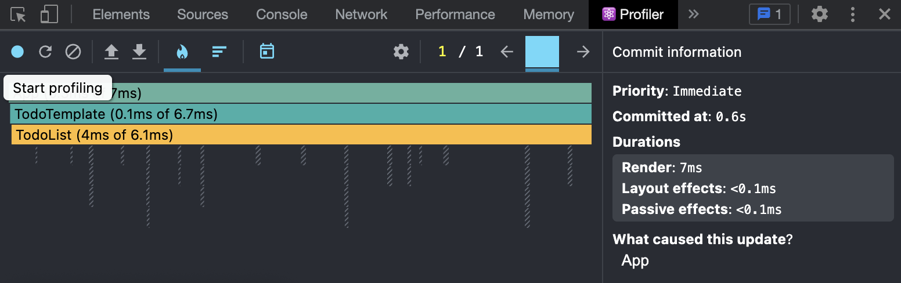
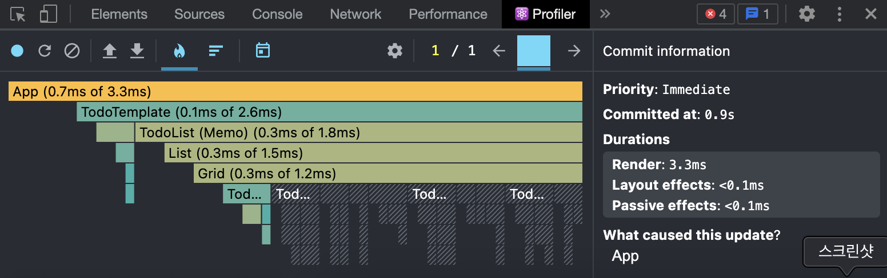

# react-todo

### 컴포넌트 구성



- **TodoTemplate**
- **TodoInsert**
- **TodoListItem**
- **TodoList**

<br/>
<br/>

# 컴포넌트 성능 최적화하기

#### 준비하기

- 많은 데이터 렌더링하기
  > App.js에 2500개 데이터 생성함.
- 크롬 개발자 도구를 통한 성능 모니터링
  > 크롬 개발자 도구를 통해 성능을 모니터링 해볼 수 있음.

#### 성능 최적화하기

- React.memo를 통한 컴포넌트 리렌더링 성능 최적화
- onToggle과 onRemove가 새로워지는 현상 방지하기
- react-virtualized를 사용한 렌더링 최적화

> 최적화한 코드는 해당 [커밋](https://github.com/boyon99/react_todo-app/commit/6c7fe7773cf1bd89a8448b75b37345123ba038e5#diff-69ff9403ef9db2101e493df7eaf139e2fad04894213b97ed8111bb79612d7f40)에서 확인할 수 있다.

<br/>

## 크롬 개발자 도구(React DevTools)를 통한 성능 모니터링




### 느려지는 원인 북석

다음과 같은 상황에서 리덴러링이 발생한다.

- props
- state
- 부모 컴포넌트 리덴더링
- forceUpdate()

현재 사항에서는 할일 클릭시 app 컴포넌트의 state가 변경되며 todolist의 모든 항목이 리렌더링된다. React.memo를 통해 이를 방지할 수 있다.

<br/>

## React.memo를 통한 컴포넌트 리렌더링 성능 최적화

컴포넌트의 리렌더링을 방지할 때는 `shouldComponentUpdate`라는 라이프사이클을 사용한다. 함수 컴포넌트에서는 대신 `React.memo`를 사용한다. 이는 컴포넌트의 props가 바뀌지 않으면 리렌더링하지 않도록 설정하여 리렌더링 성능을 최적화한다.

```js
export default React.memo(TodoListItem);
```

그러나 todos 배열이 업데이트 되면 onRemove와 onToggle 함수가 업데이트되므로 최적화가 되지 않는다. 함수가 계속 만들어지는 것을 방지하려면 useState의 함수형 업데이트 기능을 사용하거나 useReducer를 사용한다.

### useState의 함수형 업데이트

useState의 set 함수를 사용할 때 새로운 파라미터를 넣는 대신 상태 업데이트를 정의해주는 업데이트 함수를 넣을 수 있다. 이를 함수형 업데이트라고 한다.

```js
const [number, setNumber] = useState(0);

const onIncrease = useCallback(() => {
  setNumber((number) => number + 1); // setNumber(number + 1)
}, []);
```


 
다음과 같이 렌더링 시간이 240ms에서 7ms로 성능이 향상된 것을 확인할 수 있다. 왼쪽 회색 빗금이 그어져 있는 박스들은 `React.memo`를 통해 리렌더링되지 않은 컴포넌트를 나타낸다.

### useReducer 사용하기

useState의 함수형 업데이트 대신 useReducer를 사용하여 해결할 수도 있다.

```js
import React, { useReducer, useRef, useCallback } from 'react';
import TodoTemplate from './components/TodoTemplate';
import TodoInsert from './components/TodoInsert';
import TodoList from './components/TodoList';

function createBulkTodos() {
  const array = [];
  for (let i = 1; i <= 2500; i++) {
    array.push({
      id: i,
      text: `할 일 ${i}`,
      checked: false,
    });
  }
  return array;
}

function todoReducer(todos, action) {
  switch (action.type) {
    case 'INSERT': // 새로 추가
      // { type: 'INSERT', todo: { id: 1, text: 'todo', checked: false } }
      return todos.concat(action.todo);
    case 'REMOVE': // 제거
      // { type: 'REMOVE', id: 1 }
      return todos.filter((todo) => todo.id !== action.id);
    case 'TOGGLE': // 토글
      // { type: 'REMOVE', id: 1 }
      return todos.map((todo) =>
        todo.id === action.id ? { ...todo, checked: !todo.checked } : todo,
      );
    default:
      return todos;
  }
}

const App = () => {
  const [todos, dispatch] = useReducer(todoReducer, undefined, createBulkTodos);

  const nextId = useRef(2501);

  const onInsert = useCallback((text) => {
    const todo = {
      id: nextId.current,
      text,
      checked: false,
    };
    dispatch({ type: 'INSERT', todo });
    nextId.current += 1; // nextId 1 씩 더하기
  }, []);

  const onRemove = useCallback((id) => {
    dispatch({ type: 'REMOVE', id });
  }, []);

  const onToggle = useCallback((id) => {
    dispatch({ type: 'TOGGLE', id });
  }, []);

  return (
    <TodoTemplate>
      <TodoInsert onInsert={onInsert} />
      <TodoList todos={todos} onRemove={onRemove} onToggle={onToggle} />
    </TodoTemplate>
  );
};

export default App;
```

> App.js에 현재 코드 대신 위 코드를 사용할 수 있다.

기존 코드를 많이 고쳐야 하는 단점이 있으지만 상태 업데이트 로직을 모아서 컴포넌트 바깥이 둘 수 있는 장점이 있다. 성능상으로는 비슷하므로 자유롭게 선택할 수 있다.

<br/>

## 불변성의 중요성

```js
const onToggle = useCallback((id) => {
  setTodos((todos) =>
    todos.map((todo) =>
      todo.id === id ? { ...todo, checked: !todo.checked } : todo,
    ),
  );
}, []);
```

이렇게 기존의 값을 수정하지 않으면서 새로운 값을 만들어내는 것을 '불변성을 지킨다.'라고 한다. 불병성이 지켜지지 않으면 객체 내부의 값이 새로워져도 바뀐 것을 감지하지 못한다. 지킬 경우 `React.memo`가 props의 변경 여부를 확인해 성능을 최적화할 수 있다.

> 다만 객체나 배열의 구조가 복잡할 경우 깊을 복사를 하기가 까다로운데, immer 라이브러리는 이를 편하게 해준다.

<br/>

## react-virtualized를 사용한 렌더링 최적화

현재 나머지 항목은 스크롤해야만 볼 수 있다. 따라서 2500개 모두를 렌더링 하는 것은 비효율적이다. `react-virtualized`를 사용하면 스크롤되기 전에 보이지 않는 컴포넌트는 렌더링하지 않고 크기만 차지하게 할 수 있다.

```console
npm i react-virtualized
```

최적화를 수행하기 전에 각 항목의 실제 크기를 px 단위로 알아내야 한다. 여기서는 512px, 57px이다. react-virtualized를 사용하여 코드 수정한 후 측정한 값은 다음과 같다.


